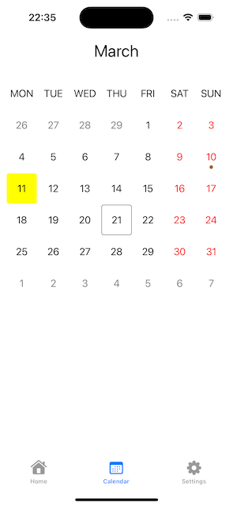

# YourCalendar
> Fully customisable horizontal calendar for Your needs written in Swift.

[![Swift Version][swift-image]][swift-url]
[![License][license-image]][license-url]

Built to be 100% customisable, YourCalendar at its core provides flexible API to build Your own calendar, but also a default implementation so that you could easily get started.



## Installation

Add this project on your `Package.swift`

```swift
import PackageDescription

let package = Package(
    dependencies: [
        .Package(url: "https://github.com/gitvalue/YourCalendar", majorVersion: 1, minor: 0)
    ]
)
```

## Usage example


```swift
import YourCalendar

// Instantiate configurator
let configurator = BasicCalendarConfigurator(
    enumerator: MonthlyCalendarViewDateEnumerator()
)

// Instantiate view
let calendarListView = CalendarListView<CalendarViewDayCell, BasicCalendarViewConfigurator>(frame: .zero)

// Update view with model
calendarListView.update(
    model: .init(
        date: .now,
        shifter: MonthlyCalendarViewDateShifter(),
        configurator: configurator
    )
)

// You're gorgeous!
```

## Release History

* 1.0.0
    * ADD: Adds first version of the calendar

## Meta

Dmitry Volosach – youtube.com/@oldnmad

Distributed under the MIT license. See ``LICENSE`` for more information.

[swift-image]:https://img.shields.io/badge/swift-5.0-orange.svg
[swift-url]: https://swift.org/
[license-image]: https://img.shields.io/badge/License-MIT-blue.svg
[license-url]: LICENSE
